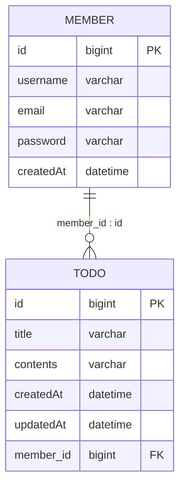
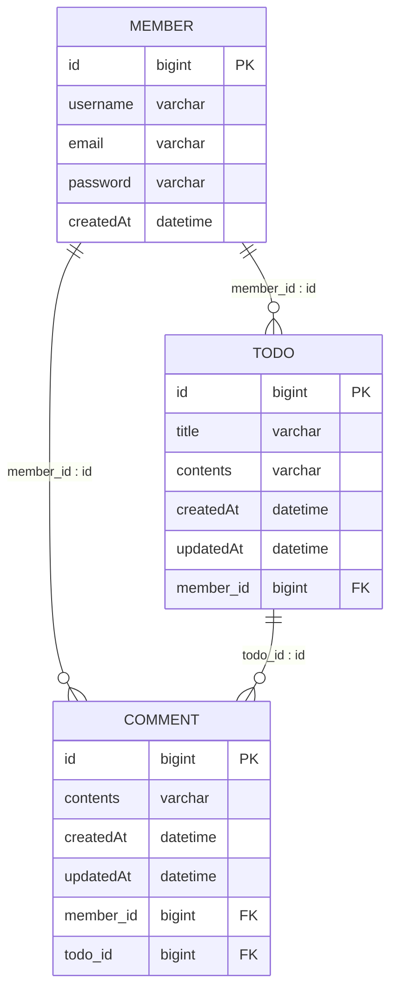

# 🗓️ 일정 관리 앱 Develop 프로젝트

## 📆 프로젝트 기간
- **개념 공부**: 2024/12/10 ~ 2024/12/12
- **프로젝트 개발**: 2024/12/13 ~ 2024/12/19

## 🛠️ 기술 스택
- Java 17
- Spring Boot 3.4.0
- MySQL Driver
- MySQL 8.0.4

## 🔗 ERD
### 📌 필수 기능 ERD Diagram



### 📌 도전 기능 ERD Diagram



## 📜 API 명세서

### 📋 일정 관련 API
- **Base URL**: `/todos`
- **Response Format**: JSON
- **Character Encoding**: UTF-8

### API List
| 기능         | HTTP Method | URL         | Request           | Response              | HTTP Status |
|------------|-------------|-------------|-------------------|-----------------------|-------------|
| 일정 생성      | POST        | /todos      | TodoRequestDto    | TodoResponseDto       | 201         |
| 전체 일정 조회   | GET         | /todos      |                   | (List)TodoResponseDto | 200         |
| 선택 일정 조회   | GET         | /todos/{id} |                   | TodoResponseDto       | 200         |
| 선택 일정 수정   | PATCH       | /todos/{id} | UpdatedRequestDto |                       | 200         |
| 선택 일정 삭제   | DELETE      | /todos/{id} |                   |                       | 200         |

### API Details
### **`POST` 일정 생성**
#### Request
- **URL** : `http://localhost:8080/todos/signup`
- **RequestBody**

  | 필드 이름      | 필수 여부 | 타입     | 설명            |
  |------------|-------|--------|---------------|
  | `title`    | 필수    | String | 일정의 제목        |
  | `contents` | 필수    | String | 일정의 내용        |
  | `memberId` | 필수    | Long   | 유저의 고유 식별자 id |

- **RequestBody 예시**
```json
{
    "title" : "일정 제목",
    "contents" : "일정 내용",
    "memberId" : 회원의 고유 식별자 id
}
```

#### Response
- **ResponseBody**

| 필드 이름      | 타입                | 설명              |
|------------|-------------------|-----------------|
| `id`       | Long              | 일정의 고유 식별자 id   |
| `title`    | String            | 일정의 제목          |
| `contents` | String            | 일정의 내용          |
| `member`   | MemberResponseDto | 회원의 id, 이름, 이메일 |

- **ResponseBody 예시**
```json
{
    "id": 1,
    "title": "할일 제목",
    "contents": "할일 내용",
    "member": {
        "id": 1,
        "username": "회원 이름",
        "email": "회원의 이메일"
    }
}
```

#### Error Response Code

| HTTP Status | 설명          |
|-------------|-------------|
| `400`       | BAD_REQUEST |

---

### **`GET` 전체 일정 조회**
#### Request
-  **URL** : `http://localhost:8080/todos`

#### Response
- **ResponseBody**

| 필드 이름      | 타입                | 설명              |
|------------|-------------------|-----------------|
| `id`       | Long              | 일정의 고유 식별자 id   |
| `title`    | String            | 일정의 제목          |
| `contents` | String            | 일정의 내용          |
| `member`   | MemberResponseDto | 회원의 id, 이름, 이메일 |

- **ResponseBody 예시**
```json
[
  {
    "id": 1,
    "title": "할일 제목",
    "contents": "할일 내용",
    "member": {
      "id": 1,
      "username": "회원 이름",
      "email": "회원의 이메일"
    }
  },
  {
    "id": 2,
    "title": "할일 제목",
    "contents": "할일 내용",
    "member": {
      "id": 1,
      "username": "회원 이름",
      "email": "회원의 이메일"
    }
  }
]
```

---

### **`GET` 선택 일정 조회**
#### Request
- **URL** : `http://localhost:8080/todos/{id}`

- **Query Parameters**

| 필드 이름      | 필수 여부 | 타입     | 설명            |
|------------|-------|--------|---------------|
| `id`       | 필수    | String | 일정의 고유 식별자 id |

- **Query Parameters 예시**
```Text
GET /todos/1
```

#### Response
- **ResponseBody**

| 필드 이름      | 타입                | 설명              |
|------------|-------------------|-----------------|
| `id`       | Long              | 일정의 고유 식별자 id   |
| `title`    | String            | 일정의 제목          |
| `contents` | String            | 일정의 내용          |
| `member`   | MemberResponseDto | 회원의 id, 이름, 이메일 |

- **ResponseBody 예시**
```json
{
    "id": 1,
    "title": "할일 제목",
    "contents": "할일 내용",
    "member": {
        "id": 1,
        "username": "회원 이름",
        "email": "회원의 이메일"
    }
}
```

#### Error Response Code

| HTTP Status | 설명          |
|-------------|-------------|
| `400`       | BAD_REQUEST |
| `404`       | NOT_FOUND   |

---

### **`PATCH` 선택 일정 수정**
#### Request
- **URL** : `http://localhost:8080/todos/{id}`

- **Query Parameters**

| 필드 이름      | 필수 여부 | 타입     | 설명            |
|------------|-------|--------|---------------|
| `id`       | 필수    | String | 일정의 고유 식별자 id |

- **Query Parameters 예시**
```Text
PATCH /todos/1
```

- **RequestBody**

| 필드 이름      | 필수 여부 | 타입     | 설명            |
|------------|-------|--------|---------------|
| `title`    | 필수    | String | 일정의 제목        |
| `contents` | 필수    | String | 일정의 내용        |

- **RequestBody 예시**
```json
{
    "title" : "수정하고자 하는 일정 제목",
    "contents" : "수정하고자 하는 일정 내용"
}
```

#### Response

#### Error Response Code

| HTTP Status | 설명          |
|-------------|-------------|
| `400`       | BAD_REQUEST |
| `404`       | NOT_FOUND   |

---

### **`DELETE` 선택 일정 삭제**
#### Request
- **URL** : `http://localhost:8080/todos/{id}`

- **Query Parameters**

| 필드 이름      | 필수 여부 | 타입     | 설명            |
|------------|-------|--------|---------------|
| `id`       | 필수    | String | 일정의 고유 식별자 id |

- **Query Parameters 예시**
```Text
DELETE /todos/1
```

#### Response

#### Error Response Code

| HTTP Status | 설명          |
|-------------|-------------|
| `400`       | BAD_REQUEST |
| `404`       | NOT_FOUND   |

---

### 📜 유저 관련 API
- **Base URL**: `/members`
- **Response Format**: JSON
- **Character Encoding**: UTF-8

### API List
| 기능       | HTTP Method | URL           | Request                | Response                | HTTP Status |
|----------|-------------|---------------|------------------------|-------------------------|-------------|
| 유저 생성    | POST        | /members      | MemberRequestDto       | MemberResponseDto       | 201         |
| 전체 유저 조회 | GET         | /members      |                        | (List)MemberResponseDto | 200         |
| 선택 유저 조회 | GET         | /members/{id} |                        | MemberResponseDto       | 200         |
| 선택 유저 수정 | PATCH       | /members/{id} | UpdateMemberRequestDto |                         | 200         |
| 선택 유저 삭제 | DELETE      | /members/{id} |                        |                         | 200         |

### API Details
### **`POST` 유저 생성**
#### Request
- **URL** : `http://localhost:8080/members`

- **RequestBody**

| 필드 이름      | 필수 여부 | 타입     | 설명       |
  |------------|-------|--------|----------|
| `username` | 필수    | String | 유저의 이름   |
| `email`    | 필수    | String | 유저의 이메일  |
| `password` | 필수    | String | 유저의 비밀번호 |

- **RequestBody 예시**
```json
{
    "username" : "유저의 이름",
    "email" : "유저의 이메일",
    "password" : "유저의 비밀번호"
}
```

#### Response
- **ResponseBody**

| 필드 이름      | 타입     | 설명            |
|------------|--------|---------------|
| `id`       | Long   | 유저의 고유 식별자 id |
| `username` | String | 유저의 이름        |
| `email`    | String | 유저의 이메일       |

- **ResponseBody 예시**
```json
{
    "id": 1,
    "username": "유저의 이름",
    "email": "유저의 이메일"
}
```

#### Error Response Code

| HTTP Status | 설명          |
|-------------|-------------|
| `400`       | BAD_REQUEST |

---

### **`GET` 전체 유저 조회**
#### Request
- **URL** : `http://localhost:8080/members`

#### Response
- **ResponseBody**

| 필드 이름      | 타입     | 설명            |
|------------|--------|---------------|
| `id`       | Long   | 유저의 고유 식별자 id |
| `username` | String | 유저의 이름        |
| `email`    | String | 유저의 이메일       |

- **ResponseBody 예시**
```json
[
  {
    "id": 1,
    "username": "유저의 이름",
    "email": "유저의 이메일"
  },
  {
    "id": 2,
    "username": "유저의 이름",
    "email": "유저의 이메일"
  }
]
```

---

### **`GET` 선택 일정 조회**
#### Request
- **URL** : `http://localhost:8080/members/{id}`

- **Query Parameters**

| 필드 이름      | 필수 여부 | 타입     | 설명            |
|------------|-------|--------|---------------|
| `id`       | 필수    | String | 유저의 고유 식별자 id |

- **Query Parameters 예시**
```Text
GET /memebers/1
```

#### Response
- **ResponseBody**

| 필드 이름      | 타입     | 설명            |
|------------|--------|---------------|
| `id`       | Long   | 유저의 고유 식별자 id |
| `username` | String | 유저의 이름        |
| `email`    | String | 유저의 이메일       |

- **ResponseBody 예시**
```json
{
    "id": 1,
    "username": "유저의 이름",
    "email": "유저의 이메일"
}
```

#### Error Response Code

| HTTP Status | 설명          |
|-------------|-------------|
| `400`       | BAD_REQUEST |
| `404`       | NOT_FOUND   |

---

### **`PATCH` 선택 유저 수정**
#### Request
- **URL** : `http://localhost:8080/members/{id}`

- **Query Parameters**

| 필드 이름      | 필수 여부 | 타입     | 설명            |
|------------|-------|--------|---------------|
| `id`       | 필수    | String | 유저의 고유 식별자 id |
| `password` | 필수    | String | 유저의 비밀번호      |

- **Query Parameters 예시**
```Text
PATCH /todos/1?password=1234
```

- **RequestBody**

| 필드 이름      | 필수 여부 | 타입     | 설명      |
|------------|-------|--------|---------|
| `email`    | 필수    | String | 유저의 이메일 |

- **RequestBody 예시**
```json
{
    "email" : "수정하고자 하는 유저의 이메일"
}
```

#### Response

- **Error Response Code**

| HTTP Status | 설명          |
|-------------|-------------|
| `400`       | BAD_REQUEST |
| `404`       | NOT_FOUND   |

---

### **`DELETE` 선택 유저 삭제**
#### Request
- **URL** : `http://localhost:8080/members/{id}`

- **Query Parameters**

| 필드 이름      | 필수 여부 | 타입     | 설명            |
|------------|-------|--------|---------------|
| `id`       | 필수    | String | 유저의 고유 식별자 id |
| `password` | 필수    | String | 유저의 비밀번호      |

- **Query Parameters 예시**
```Text
DELETE /todos/1?password=1234
```

#### Response

#### Error Response Code

| HTTP Status | 설명          |
|-------------|-------------|
| `400`       | BAD_REQUEST |
| `404`       | NOT_FOUND   |

---

### 📜 댓글 관련 API
- **Base URL**: /comments
- **Response Format**: JSON
- **Character Encoding**: UTF-8

### API List
| 기능       | HTTP Method | URL            | Request                 | Response                 | HTTP Status |
|----------|-------------|----------------|-------------------------|--------------------------|-------------|
| 댓글 생성    | POST        | /comments      | CreateCommentRequestDto | CreateCommentResponseDto | 201         |
| 전체 댓글 조회 | GET         | /comments      |                         | (List)CommentResponseDto | 200         |
| 선택 댓글 조회 | GET         | /comments/{id} |                         | (List)CommentResponseDto | 200         |
| 선택 댓글 수정 | PATCH       | /comments/{id} | UpdateCommentRequestDto |                          | 200         |
| 선택 댓글 삭제 | DELETE      | /comments/{id} |                         |                          | 200         |

### API Details
### **`POST` 댓글 생성**
#### Request
- **URL** : `http://localhost:8080/comments`

- **RequestBody**

| 필드 이름      | 필수 여부 | 타입     | 설명            |
|------------|-------|--------|---------------|
| `contents` | 필수    | String | 댓글의 내용        |
| `memberId` | 필수    | Long   | 유저의 고유 식별자 id |
| `todoId`   | 필수    | Long   | 일정의 고유 식별자 id |

- **RequestBody 예시**
```json
{
    "contents" : "댓글의 내용",
    "memberId" : 유저의 고유 식별자 id,
    "todoId" : 일정의 고유 식별자 id
}
```

#### Response
- **ResponseBody**

| 필드 이름             | 타입     | 설명            |
|-------------------|--------|---------------|
| `id`              | Long   | 댓글의 고유 식별자 id |
| `contents`        | String | 댓글의 내용        |
| `todo_id`         | Long   | 일정의 고유 식별자 id |
| `todo_title`      | String | 일정의 제목        |
| `todo_contents`   | String | 일정의 내용        |
| `member_id`       | Long   | 유저의 고유 식별자 id |
| `member_username` | String | 유저의 이름        |
| `member_email`    | String | 유저의 이메일       |

- **ResponseBody 예시**
```json
{
    "id": 1,
    "contents": "댓글의 내용",
    "todo": {
        "id": 1,
        "title": "일정의 제목",
        "contents": "일정의 내용",
        "member": {
            "id": 1,
            "username": "유저의 이름",
            "email": "유저의 이메일"
        }
    }
}
```

#### Error Response Code

| HTTP Status | 설명          |
|-------------|-------------|
| `400`       | BAD_REQUEST |

---

### **`GET` 전체 댓글 조회**
#### Request
- **URL** : `http://localhost:8080/comments`

#### Response
- **ResponseBody**

| 필드 이름             | 타입     | 설명            |
|-------------------|--------|---------------|
| `id`              | Long   | 댓글의 고유 식별자 id |
| `contents`        | String | 댓글의 내용        |
| `todo_id`         | Long   | 일정의 고유 식별자 id |
| `todo_title`      | String | 일정의 제목        |
| `todo_contents`   | String | 일정의 내용        |
| `member_id`       | Long   | 유저의 고유 식별자 id |
| `member_username` | String | 유저의 이름        |
| `member_email`    | String | 유저의 이메일       |

- **ResponseBody 예시**
```json
[
  {
    "id": 1,
    "contents": "댓글의 내용",
    "todo": {
      "id": 1,
      "title": "일정의 제목",
      "contents": "일정의 내용",
      "member": {
        "id": 1,
        "username": "유저의 이름",
        "email": "유저의 이메일"
      }
    }
  },
  {
    "id": 2,
    "contents": "댓글의 내용",
    "todo": {
      "id": 1,
      "title": "일정의 제목",
      "contents": "일정의 내용",
      "member": {
        "id": 1,
        "username": "유저의 이름",
        "email": "유저의 이메일"
      }
    }
  }
]
```

---

### **`GET` 선택한 일정의 전체 댓글 조회**
#### Request
- **URL** : `http://localhost:8080/comments/{todoId}`

- **Query Parameters**

| 필드 이름    | 필수 여부 | 타입     | 설명            |
|----------|-------|--------|---------------|
| `todoId` | 필수    | String | 일정의 고유 식별자 id |

- **Query Parameters 예시**
```Text
GET /comments/1
```

#### Response
- **ResponseBody**

| 필드 이름             | 타입     | 설명            |
|-------------------|--------|---------------|
| `id`              | Long   | 댓글의 고유 식별자 id |
| `contents`        | String | 댓글의 내용        |
| `todo_id`         | Long   | 일정의 고유 식별자 id |
| `todo_title`      | String | 일정의 제목        |
| `todo_contents`   | String | 일정의 내용        |
| `member_id`       | Long   | 유저의 고유 식별자 id |
| `member_username` | String | 유저의 이름        |
| `member_email`    | String | 유저의 이메일       |

- **ResponseBody 예시**
```json
[
  {
    "id": 1,
    "contents": "댓글의 내용",
    "todo": {
      "id": 1,
      "title": "일정의 제목",
      "contents": "일정의 내용",
      "member": {
        "id": 1,
        "username": "유저의 이름",
        "email": "유저의 이메일"
      }
    }
  },
  {
    "id": 2,
    "contents": "댓글의 내용",
    "todo": {
      "id": 1,
      "title": "일정의 제목",
      "contents": "일정의 내용",
      "member": {
        "id": 1,
        "username": "유저의 이름",
        "email": "유저의 이메일"
      }
    }
  }
]
```

#### Error Response Code

| HTTP Status | 설명          |
|-------------|-------------|
| `400`       | BAD_REQUEST |
| `404`       | NOT_FOUND   |

---

### **`PATCH` 선택 댓글 수정**
#### Request
- **URL** : `http://localhost:8080/comments/{id}`

- **Query Parameters**

| 필드 이름      | 필수 여부 | 타입     | 설명            |
|------------|-------|--------|---------------|
| `id`       | 필수    | String | 댓글의 고유 식별자 id |
| `password` | 필수    | String | 유저의 비밀번호      |

- **Query Parameters 예시**
```Text
PATCH /comments/1?password=1234
```

- **RequestBody**

| 필드 이름      | 필수 여부 | 타입     | 설명     |
|------------|-------|--------|--------|
| `contents` | 필수    | String | 댓글의 내용 |

- **RequestBody 예시**
```json
{
    "contents" : "수정하고자 하는 댓글의 내용"
}
```

#### Response

#### Error Response Code

| HTTP Status | 설명          |
|-------------|-------------|
| `400`       | BAD_REQUEST |
| `404`       | NOT_FOUND   |

---

### **`DELETE` 선택 유저 삭제**
#### Request
- **URL** : `http://localhost:8080/comments/{id}`

- **Query Parameters**

| 필드 이름      | 필수 여부 | 타입     | 설명            |
|------------|-------|--------|---------------|
| `id`       | 필수    | String | 댓글의 고유 식별자 id |
| `password` | 필수    | String | 유저의 비밀번호      |

- **Query Parameters 예시**
```Text
DELETE /comments/1?password=1234
```

#### Response

#### Error Response Code

| HTTP Status | 설명          |
|-------------|-------------|
| `400`       | BAD_REQUEST |
| `404`       | NOT_FOUND   |

---

### 📜 로그인 관련 API
- **Base URL**: /auth
- **Response Format**: JSON
- **Character Encoding**: UTF-8

### API List
| 기능          | HTTP Method | URL                 | Request                             | Response | HTTP Status |
|-------------|-------------|---------------------|-------------------------------------|----------|-------------|
| session 로그인 | POST        | /auth/session-login | LoginRequestDto, HttpServletRequest |          | 200         |

### API Details
### **`POST` Session 로그인**
#### Request
- **URL** : `http://localhost:8080/auth/session-login`

- **RequestBody**

| 필드 이름      | 필수 여부 | 타입     | 설명       |
|------------|-------|--------|----------|
| `email`    | 필수    | String | 유저의 이메일  |
| `password` | 필수    | String | 유저의 비밀번호 |

- **RequestBody 예시**
```json
{
    "email" : "유저의 이메일",
    "password" : "유저의 비밀번호"
}
```

#### Response

#### Error Response Code

| HTTP Status | 설명           |
|-------------|--------------|
| `401`       | UNAUTHORIZED |

---

## 📊 Data Schema
```sql
CREATE TABLE todo
(
    id BIGINT AUTO_INCREMENT PRIMARY KEY,
    title VARCHAR(255) NOT NULL,
    contents VARCHAR(255) NOT NULL,
    created_at DATETIME NOT NULL,
    updated_at DATETIME NOT NULL,
    member_id BIGINT,
    FOREIGN KEY (member_id) REFERENCES member (id)
);

CREATE TABLE member
(
    id BIGINT AUTO_INCREMENT PRIMARY KEY,
    username VARCHAR(255) NOT NULL,
    password VARCHAR(255) NOT NULL,
    created_at DATETIME NOT NULL,
    updated_at DATETIME NOT NULL
);

CREATE TABLE comment
(
    id BIGINT AUTO_INCREMENT PRIMARY KEY,
    contents VARCHAR(255) NOT NULL,
    created_at DATETIME NOT NULL,
    updated_at DATETIME NOT NULL,
    member_id BIGINT,
    todo_id BIGINT,
    FOREIGN KEY (member_id) REFERENCES member (id),
    FOREIGN KEY (todo_id) REFERENCES todo (id)
);
```

## 🚀 주요 기능
- **일정에 대한 CRUD 기능 구현**
- **유저에 대한 CRUD 기능 구현**
- **댓글에 대한 CRUD 기능 구현**
- **JPA를 사용해서 MySQL 데이터베이스에 데이터 저장**

## 🔗 추가 정보
- [블로그 방문](https://carrot0911.tistory.com/)
- [트러블 슈팅](https://carrot0911.tistory.com/141)